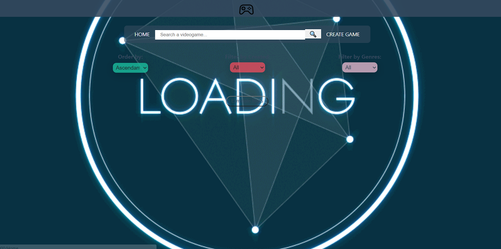
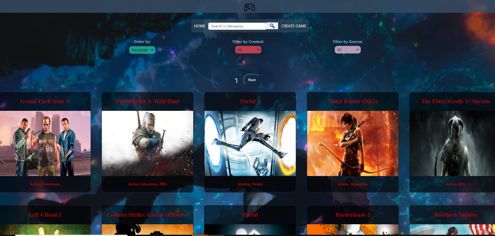

# Individual Project - Videogames

<div align="center"> </div>
<h1></h1>

___
## Videogames

<p> "Videogames" fue el proyecto individual que tuve asignado en la que constaba en construir una App en un periodo de 3 semanas como deadline, programando en Javascript y utilizando las tecnologias de React, Redux, Sequelize, Sqlite, postgresql. 
Para los estilos utilice CSS puro, dado que así era el requerimiento. 
</p>

## ¿De qué se trata este Proyecto?

<p>
El objetivo principal del mismo fue que aprendamos a resolver las distintas problematicas del proyecto pedido sin utilizar librerias externas, es decir, las problematicas presentadas de paginación, filtrado, ordenamiento de los componentes y estilos de los mismos fue pedida con intencionalidad de aprendizaje para que se realice de manera manual y no utilizando endpoints de la API o librerias externas, de no ser así, quizás tendria más sentido que se haya planteado de otra manera ya que quizás las mismas tienen resultas una problemática de una manera más eficiente o mejor estéticamente hablando y más fáciles de utilizar. </p>

---

## Requerimientos del Proyecto Asignado y Funcionalidades

### Enunciado Pedido

La idea general fué crear una aplicación en la cual se puedan ver los distintos videojuegos disponibles junto con información relevante de los mismos utilizando la api externa [rawg](https://rawg.io/apidocs) y a partir de ella poder, entre otras cosas:

- Buscar videjuegos (haciendo el request a la api a los más de 500mil juegos)
- Filtrarlos / Ordenarlos
- Agregar nuevos videojuegos a la base de datos
- Aplicar mejores prácticas
- Utilizar el workflow de GIT.
- Realizar testing al menos 1 en backend y 1 en Frontend.

___
___
# Frontend

Aplicación de React/Redux que contenga las siguientes /rutas.

**Pagina inicial**: LandingPage con

- [ ] Alguna imagen de fondo representativa al proyecto
- [ ] Botón para ingresar al Home (`Ruta principal`)

**Ruta principal**: 

- [ ] Al ingresar al Home se tienen que renderizar los videojuegos y las siguientes opciones detalladas.
- [ ] Input de búsqueda para encontrar videojuegos por nombre que hagan match con la base de datos y la vez también con la api
- [ ] Área donde se verá el listado de videojuegos. Deberá mostrar su:
  - Imagen
  - Nombre
  - Géneros
  - Plataformas

- [ ] Botones/Opciones para filtrar por género y por videojuego existente o agregado por nosotros en la base de datos.
- [ ] Botones/Opciones para ordenar tanto ascendentemente como descendentemente los videojuegos por orden alfabético, cantidad de palabras y por rating.
- [ ] Paginado para ir buscando y mostrando los siguientes videojuegos, mostrar 15 juegos por pagina. Solo almacenar 100.


**Ruta de detalle de videojuego**: debe contener

- [ ] Los campos mostrados en la ruta principal para cada videojuegos  (imagen, nombre, y géneros) y además
- [ ] Descripción
- [ ] Fecha de lanzamiento
- [ ] Rating
- [ ] Plataformas

**Ruta de creación de videojuegos**: debe contener

- [ ] Un formulario **controlado** con los siguientes campos
  - Nombre
  - Descripción
  - Fecha de lanzamiento
  - Rating
- [ ] Posibilidad de seleccionar/agregar varios géneros
- [ ] Posibilidad de seleccionar/agregar varias plataformas
- [ ] Botón/Opción para crear un nuevo videojuego
- [ ] Botón/Opción para volver al home

**IMPORTANTE**: No se permitirá utilizar librerías externas para aplicar estilos a la aplicación. Tendrán que utilizar CSS con algunas de las opciones que vimos en dicha clase (CSS puro, CSS Modules o Styled Components)

____
____
# Backend

Desarrollar un servidor en Node/Express con las siguientes rutas:

**IMPORTANTE**: No está permitido utilizar los filtrados, ordenamientos y paginados brindados por la API externa, todas estas funcionalidades tienen que ser implementadas.

- [ ] **GET /videogames**:
  - Obtener un listado de los videojuegos
  - Debe devolver solo los datos necesarios para la ruta principal
- [ ] **GET /videogames?name="..."**:
  - Obtener un listado de las primeros 15 videojuegos que contengan la palabra ingresada como query parameter
  - Si no existe ningún videojuego mostrar un mensaje adecuado
- [ ] **GET /videogame/{idVideogame}**:
  - Obtener el detalle de un videojuego en particular
  - Debe traer solo los datos pedidos en la ruta de detalle de videojuego
  - Incluir los géneros asociados
- [ ] **GET /genres**:
  - Obtener todos los tipos de géneros de videojuegos posibles
  - En una primera instancia deberán traerlos desde rawg y guardarlos en su propia base de datos y luego ya utilizarlos desde allí. 
- [ ] **POST /addGame**:
  - Recibe los datos recolectados desde el formulario controlado de la ruta de creación de videojuego por body
  - Crea un videojuego en la base de datos


### Únicos Endpoints/Flags que pueden utilizar

- GET https://api.rawg.io/api/games
- GET https://api.rawg.io/api/games?search={game}
- GET https://api.rawg.io/api/genres
- GET https://api.rawg.io/api/games/{id}
___
___
# Base de datos

El modelo de la base de datos deberá tener las siguientes entidades (Aquellas propiedades marcadas con asterísco deben ser obligatorias):

- [ ] Videojuego con las siguientes propiedades:
  - ID: \* No puede ser un ID de un videojuego ya existente en la API rawg
  - Nombre \*
  - Descripción \*
  - Fecha de lanzamiento
  - Rating
  - Plataformas \*
- [ ] Genero con las siguientes propiedades:
  - ID
  - Nombre

La relación entre ambas entidades debe ser de muchos a muchos ya que un videojuego puede pertenecer a varios géneros en simultaneo y, a su vez, un género puede contener múltiples videojuegos distintos. Un ejemplo sería el juego `Counter Strike` pertenece a los géneros Shooter y Action al mismo tiempo. Pero a su vez existen otros videojuegos considerados como Shooter o como Action.

**IMPORTANTE**: Pensar como modelar los IDs de los videojuegos en la base de datos. Existen distintas formas correctas de hacerlo pero tener en cuenta que cuando hagamos click en algun videojuego, este puede provenir de la API o de la Base de Datos por lo que cuando muestre su detalle no debería haber ambigüedad en cual se debería mostrar. Por ejemplo si en la API el videojuego `Age of Empires II: Age of Kings` tiene id = 1 y en nuestra base de datos creamos un nuevo videojuego `Age of Henry` con id = 1, ver la forma de diferenciarlos cuando querramos acceder al detalle del mismo.

___
___

# Duración del proyecto

El proyecto tendrá una duración máxima de tres semanas.

___
___
# Testing

Indicaciones para Testing:

- [ ] Al menos tener un componente del frontend con sus tests respectivos
- [ ] Al menos tener una ruta del backend con sus tests respectivos
- [ ] Al menos tener un modelo de la base de datos con sus tests respectivos
___
___
# Indicaciones para ejecutar el proyecto

Para poder ejecutar el proyecto correctamente deberán tener en cuenta las siguientes indicaciones. Si tienes alguna consulta o duda con la instalación puedes escribirme sin problema --> [aqui](hbonavota@gmail.com)

## Instalación

+ Hacer Fork al repositorio 

<div align="center"> </div>

+ Puedes descargar el zip o clonarlo en tu Pc, si eliges clonarlo simplemente te paras en tu carpeta y con la terminal clonas el repositorio. Ejemplo:
<div align="center"> </div>

```
Git clone https://github.com/hbonavota/-PI-Videogame-FT15a.git
```  

+ En la carpeta `/api` crear un archivo llamado: `.env` que tenga la siguiente forma:

<div align="center"> </div>


+ Para Crear la ApiKey  tienen que ingresar a la página de rawg, es gratuita, no demora más de 10min crear una Apikey. Click aqui para crearla --> [rawg](https://rawg.io/apidocs)

+ Reemplazar `usuariodepostgres` y `passwordDePostgres` con tus propias credenciales para conectarte a postgres.
Si no tienes postgresql tienes que descargarlo aqui --> . [Postgresql](https://www.postgresql.org/download/)
```
DB_USER=usuariodepostgres
DB_PASSWORD=passwordDePostgres
DB_HOST=localhost
DB_PORT=3001
API_KEY= ApiKey
```


+ Adicionalmente es necesario que creen desde psql una base de datos llamada `videogames`. El comando dentro de la terminal de psql es :


```
CREATE DATABASE videogames;

```
+ Siguiendo los pasos hasta aquí debería estar todo correcto, faltaría solo instalar las dependencias. Por último tienes que situarte en la carpeta /api y realizar el npm install y repetir el mismo proceso en /client

```
/PI-Videogames/api (main)
npm i

/PI-Videogames/client (main)
npm i

```


+ Finalmente, al ejecutar los procesos 

```
/PI-Videogames/api (main)
npm start

/PI-Videogames/client (main)
npm start

```

+ Deberias visualizar la ejecución correctamente. Se abrirá una ventana en tu Browser ejecutándose en el puerto  3000 el Front y en el 3001 el backend y en la terminal veras el mensaje de conexión correcta.

<div align="center"> </div>
<div align="center"> </div>

___
___
# Preview

+ LandingPage
<div align="center"> </div>

+ Loading visible por 746.063 milisegundos hasta la carga de Videojuegos

<div align="center"> </div>

+ Home

<div align="center"> </div>

+ Page de Creación de Juegos 

<div align="center"> </div>

+ Detalle de los Juegos

<div align="center"> </div>